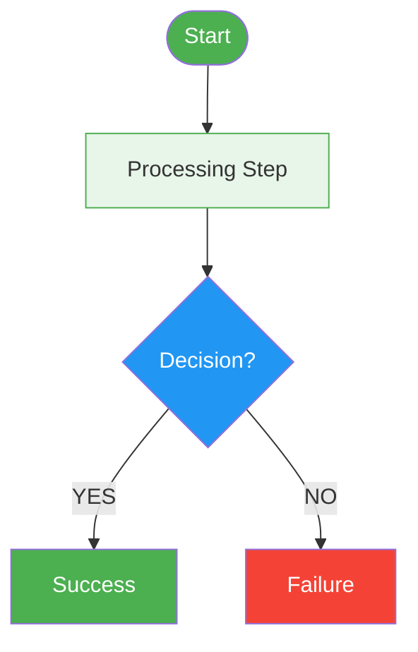

# Tech Design Doc — Confluence Publishing Workflow

## Overview

End-to-end workflow for creating production-quality technical design documents: codebase exploration, spec writing in markdown, Mermaid diagram generation, Confluence publishing with rich macros, multi-round review cycles, and implementation planning with checkpoints.

## When to Use

- User asks to create a design doc, HLD, LLD, spec, or RFC
- User wants to publish a technical document to Confluence
- User needs diagrams (flowcharts, sequence diagrams, state machines) in a doc
- User asks to "put this on Confluence" or "make this look good on Confluence"
- User wants to create an implementation plan from a spec
- User says "design this feature" or "write a spec for this"

## Core Workflow (7 Phases)

```
Phase 1: Explore → Phase 2: Design → Phase 3: Diagrams → Phase 4: Publish →
Phase 5: Review → Phase 6: Fix → Phase 7: Implementation Plan
```

---

### Phase 1: Explore the Codebase First

**Never design in a vacuum.** Before writing a single line of spec, understand the existing system.

1. **Spawn an Explore agent** to map the current architecture — entities, managers, controllers, consumers, SFN definitions, DB schema
2. **Identify integration points** — what services does this system already talk to? What patterns does it use?
3. **Read the existing enums, factories, base classes** — your design must follow existing conventions
4. **Check Flyway migration numbering** — what's the next available version?
5. **Map the existing data flow** — which tables are read/written at each step?

**Output:** A mental model of the system you're designing into. Quote file paths, class names, patterns.

### Phase 2: Write the Spec (Local Markdown)

Write the spec as a local `.md` file first. This is the **source of truth**. Confluence is just the rendered view.

```
SPEC_FILE="${REPO_ROOT}/FEATURE_NAME_SPEC.md"
```

**Spec structure — battle-tested order:**

| Section | Content | Why This Order |
|---|---|---|
| 1. Overview | What + why in 3 bullets | Reader decides in 10 seconds if this is relevant |
| 2. User Journey | Numbered steps, plain language | Non-technical stakeholders read this |
| 3. New Enums/Types | Code snippet | Establishes vocabulary for rest of doc |
| 4. Timer/Scheduler Design | If applicable | Foundational — everything depends on timing |
| 5. State Machine / SFN | ASCII or diagram | The core orchestration logic |
| 6. Status Transitions | Full table: from → to → trigger → actor → terminal? | Most referenced section during implementation |
| 7-9. Integration details | Scheduler, queues, DB, APIs | Technical depth sections |
| 10. DB Changes | Schema + migration SQL | Concrete — developers need exact DDL |
| 11. API Changes | Endpoints + request/response | Contract for consumers |
| 12. Configuration | Property table with defaults | Ops needs this for deployment |
| 13-14. Edge cases | Cancellation, comms, error handling | What happens when things go wrong |
| 15+. External integrations | Document processing, partner APIs, etc. | Full API call sequences with request/response |
| N-2. What's NOT changing | Explicit list | Prevents scope creep and reassures reviewers |
| N-1. Open Questions | With RESOLVED status | Shows decision trail |
| N. Appendix | JIRA, owners, links | Project metadata at the top of Confluence page |

**Key principles:**
- **Every status needs a transition map** — from, to, trigger, actor, terminal?
- **Every API needs request + response** — even internal ones
- **Every DB change needs exact DDL** — not "add a column", but `ALTER TABLE x ADD COLUMN y VARCHAR(255)`
- **Every config needs a default** — never leave it as "TBD"
- **Every external call needs error handling defined** — what happens on failure?

### Phase 3: Generate Diagrams with Mermaid

Use `mmdc` (mermaid-cli) to render diagrams locally as PNG. **Never use Mermaid macros on Confluence** — most instances don't have the app installed.

```bash
# Install if needed
npm install -g @mermaid-js/mermaid-cli

# Render with high quality
mmdc -i diagram.mmd -o diagram.png -w 1400 -b transparent --scale 2
```

**Which diagram type for what:**

| Diagram | Mermaid Syntax | Best For | Example |
|---|---|---|---|
| HLD / System Architecture | `graph TB` with `subgraph` | Component overview, service interaction | Show all services, DBs, queues, external APIs |
| State Machine | `stateDiagram-v2` | Entity lifecycle, status transitions | Inspection: INITIATED → PENDING → SUBMITTED → APPROVED |
| Sequence Diagram | `sequenceDiagram` | Multi-service API call flow | App service → Doc processor → S3 → Downstream service → Partner |
| Flowchart (top-down) | `graph TD` | Decision trees, SFN steps | SFN with Choice states, catch blocks, loops |
| Flowchart (left-right) | `graph LR` | Interaction between parallel systems | SFN ↔ Comms module interaction |

**Color palette for consistent diagrams:**

```
Green   #4CAF50  → success, start, complete, approved
Red     #f44336  → failure, terminal, rejected, error
Orange  #FF9800  → warning, lapse, timeout
Blue    #2196F3  → decision points, choice states
Lt Blue #E3F2FD  → wait states, paused
Lt Green #E8F5E9 → active processing steps
Pink    #FCE4EC  → urgent/immediate actions
Grey    #F5F5F5  → background for subgraphs
```

**Styling example:**


**Dotted lines for async/error paths:**
```
A -.->|"error path"| B    # dotted arrow
A -->|"happy path"| C      # solid arrow
```

**Recommended diagram set for a design doc:**
1. **HLD** — system architecture (always)
2. **State lifecycle** — if there are status transitions (always for stateful systems)
3. **Main flow** — SFN/workflow flowchart (always)
4. **Sequence diagram** — for multi-service API flows (when 3+ services involved)
5. **Cancellation/error flow** — if non-trivial error handling
6. **Subsystem interaction** — if there's a sidecar/decoupled module (e.g., comms)

### Phase 4: Publish to Confluence

**Always GET current version before PUT. Version mismatch = update rejected.**

#### Confluence Storage Format — Key Macros

| Macro | Usage | XML |
|---|---|---|
| TOC | Table of contents | `<ac:structured-macro ac:name="toc"><ac:parameter ac:name="maxLevel">3</ac:parameter></ac:structured-macro>` |
| Status lozenge | Colored badge | `<ac:structured-macro ac:name="status"><ac:parameter ac:name="colour">Yellow</ac:parameter><ac:parameter ac:name="title">IN REVIEW</ac:parameter></ac:structured-macro>` |
| Info panel | Blue callout | `<ac:structured-macro ac:name="info"><ac:rich-text-body><p>text</p></ac:rich-text-body></ac:structured-macro>` |
| Note panel | Yellow callout | `ac:name="note"` (same structure as info) |
| Warning panel | Red callout | `ac:name="warning"` (same structure as info) |
| Expand | Collapsible | `<ac:structured-macro ac:name="expand"><ac:parameter ac:name="title">Title</ac:parameter><ac:rich-text-body>content</ac:rich-text-body></ac:structured-macro>` |
| Code block | Syntax highlight | `<ac:structured-macro ac:name="code"><ac:parameter ac:name="language">java</ac:parameter><ac:plain-text-body><![CDATA[code]]></ac:plain-text-body></ac:structured-macro>` |
| Image | Embedded diagram | `<ac:image ac:width="900"><ri:attachment ri:filename="file.png" /></ac:image>` |

**Lozenge colors:** Green, Yellow, Blue, Red, Grey

**Where to use each macro:**
- **Info panel** → Overview, key design principles, important notes
- **Note panel** → Technical context (e.g., "The Scheduler service owns all delayed/recurring job dispatch")
- **Warning panel** → Critical constraints ("Do NOT cancel the timer")
- **Expand** → Long code blocks, pseudocode, detailed examples
- **Status lozenges** → Status tables (PENDENCY=Yellow, POST_PENDENCY=Blue, TERMINAL=Red), V1 vs V2 comparison (Red=old, Green=new), open questions (RESOLVED=Green)

#### Method 1: Jira MCP (preferred — works for both read and write)

```
# Read page + version
mcp__jira__jira_get 
  path="/wiki/rest/api/content/{pageId}" 
  queryParams={"expand": "version"}
  jq="{version: version.number}"

# Update page (ALWAYS increment version)
mcp__jira__jira_put 
  path="/wiki/rest/api/content/{pageId}" 
  body={
    "id": "{pageId}", "type": "page", "title": "Page Title",
    "space": {"key": "SPACE_KEY"},
    "body": {"storage": {"value": "<html>", "representation": "storage"}},
    "version": {"number": currentVersion + 1, "message": "What changed"}
  }
```

#### Method 2: Playwright browser (for large pages or when Jira MCP has payload limits)

```javascript
// Read + modify + push in browser context (avoids payload size issues)
await page.evaluate(async () => {
  const resp = await fetch('/wiki/rest/api/content/{pageId}?expand=body.storage,version', {
    headers: { 'Accept': 'application/json' }
  });
  const data = await resp.json();
  let body = data.body.storage.value;
  
  // Modify body...
  body = body.replace('old text', 'new text');
  
  // Push
  await fetch('/wiki/rest/api/content/{pageId}', {
    method: 'PUT',
    headers: { 'Content-Type': 'application/json', 'Accept': 'application/json' },
    body: JSON.stringify({
      id: "{pageId}", type: "page", title: "Title", space: { key: "KEY" },
      body: { storage: { value: body, representation: "storage" } },
      version: { number: data.version.number + 1, message: "Update" }
    })
  });
});
```

#### Method 3: Restore from version history (when you accidentally break content)

```javascript
// Fetch old version body, apply fixes, push as new version
const resp = await fetch('/wiki/rest/api/content/{pageId}?expand=body.storage&status=historical&version=12');
const data = await resp.json();
let body = data.body.storage.value;
// Fix and push as new version
```

### Phase 5: Upload Diagrams as Attachments

**Diagrams must be PNG attachments, not inline Mermaid macros.**

1. Copy PNGs to Playwright-accessible directory (`.playwright-mcp/`)
2. Create hidden file input on the page
3. Trigger file chooser → use `browser_file_upload`
4. Reference in body: `<ac:image ac:width="900"><ri:attachment ri:filename="diagram.png" /></ac:image>`

```javascript
// Upload pattern
page.evaluate(() => {
  const input = document.createElement('input');
  input.type = 'file';
  input.id = '__upload';
  document.body.appendChild(input);
  input.addEventListener('change', async () => {
    const form = new FormData();
    form.append('file', input.files[0], input.files[0].name);
    await fetch('/wiki/rest/api/content/{pageId}/child/attachment', {
      method: 'POST', // POST for new, PUT for update existing
      headers: { 'X-Atlassian-Token': 'nocheck' },
      body: form
    });
  });
});
// Then click input → browser_file_upload with file paths
```

**To update an existing attachment:** Use `PUT` instead of `POST` with the same filename.

### Phase 6: Review Cycle

Spawn agents for different review perspectives:

| Review Type | Agent Prompt | What It Catches |
|---|---|---|
| **Self-review** | "Read the full spec, find contradictions, stale references, missing sections" | Inconsistencies, dead references, numbering errors |
| **Architect review** | "Review as a principal architect: sequencing risks, integration gaps, rollout, monitoring" | Missing workstreams, cross-team deps, operational gaps |
| **Consistency check** | "Cross-check spec vs implementation plan, quote exact text" | Mismatches between what's designed and what's planned |
| **V1 compatibility** | "Read V1 code + V2 plan, verify no V1 regressions" | Breaking changes, shared resource conflicts, enum risks |

**Review checklist that catches 90% of issues:**
- [ ] Every status in the transition table has a "from" and "to"
- [ ] Every API has request AND response defined
- [ ] Every config property has a default value
- [ ] Every SQS queue is in the provisioning list
- [ ] Every external call has error handling defined
- [ ] Feature flag / kill switch exists
- [ ] Rollback plan is documented
- [ ] Monitoring / alerting is specified
- [ ] Cross-team dependencies are listed with owners

### Phase 7: Implementation Plan

Write as local markdown — **NOT on Confluence** (impl plans change too fast).

**Structure:**
```
# Steps (small, testable units)
Each step has:
  - Files to create/modify
  - Code snippets showing the pattern
  - Test gate: "done when X passes"

# Checkpoints (verification gates)
Group steps into checkpoints. Don't move past a checkpoint until its gate passes.

# Dependency graph
What blocks what. What can run in parallel.

# Placeholder strategy
Stub external services with TODO implementations.
Build and test all internal logic first.
Swap stubs for real impls when external services are ready.
```

**Placeholder pattern for external services:**
```java
// PLACEHOLDER — returns mock data until real service is ready
public ArchiveResponse archiveDocuments(String id, ArchiveRequest request) {
    // TODO: Replace with real HTTP call when archive API is deployed
    log.warn("PLACEHOLDER: archiveDocuments called for id={}", id);
    return ArchiveResponse.builder()
        .url("https://placeholder.com/mock.zip")
        .build();
}
```

---

## Quick Reference: Confluence Page Structure

```
1. Title + Status Lozenge (IN REVIEW / APPROVED / DRAFT)
2. Appendix table (JIRA, Dev Owner, Stakeholders, QA, PRD, Figma, Repos)
3. Table of Contents (TOC macro, maxLevel=3)
4. HLD diagram (system architecture)
5. Overview (info panel — 3 key bullets)
6. User Journey (numbered steps, plain language)
7. Core design sections (enums, timers, state machine, SFN)
8. Status transition table (with colored lozenges)
9. Integration sections (DB, APIs, config, external services)
10. Cancellation / error handling
11. Sequence diagrams for multi-service flows
12. Schema changes summary (additive = safe for V1)
13. Config seeding SQL (expand macro)
14. What's NOT changing (validated list)
15. Open questions (all RESOLVED with green lozenges)
```

## Quick Reference: Mermaid CLI

```bash
# Install
npm install -g @mermaid-js/mermaid-cli

# Render single diagram
mmdc -i flow.mmd -o flow.png -w 1400 -b transparent --scale 2

# Common sizes
-w 1600  # HLD, sequence diagrams (wide)
-w 1400  # Flowcharts, state machines (standard)
-w 1000  # Small diagrams (compact)
```

## Common Mistakes

| Mistake | Fix |
|---|---|
| Mermaid macros on Confluence | Render locally as PNG → upload as attachment |
| Adding V2 listener to existing V1 consumer class | Create SEPARATE consumer class — if V2 queue fails to bind, it kills V1 listeners too |
| Putting impl plan on Confluence | Keep local — impl plans change too fast |
| HTML too large for Jira MCP PUT body | Use Playwright `browser_evaluate` to get/modify/push |
| Forgetting `X-Atlassian-Token: nocheck` | Required header for attachment uploads |
| Version mismatch on page update | Always GET current version first, then PUT with version + 1 |
| Skipping the Appendix table | Put it at the TOP — JIRA, owners, links. Reviewers need this first. |
| No feature flag / kill switch | Always add one. Default OFF. Gradual rollout with percentage. |
| "What's NOT changing" is optimistic | Validate each item. Mark "truly unchanged" vs "needs re-validation". |
| No rollback plan | Document: flag off → in-flight items lapse → code rollback safe. |
| Skipping codebase exploration | Never design in a vacuum. Read existing patterns first. |
| Using `PATCH` vs `PUT` vs `POST` inconsistently | Pick one convention for each API, use everywhere. |
| Diagrams not color-coded | Use consistent palette: green=success, red=failure, blue=decision, orange=warning |
| Section numbering breaks | Number sections once in markdown, re-verify after every edit |
